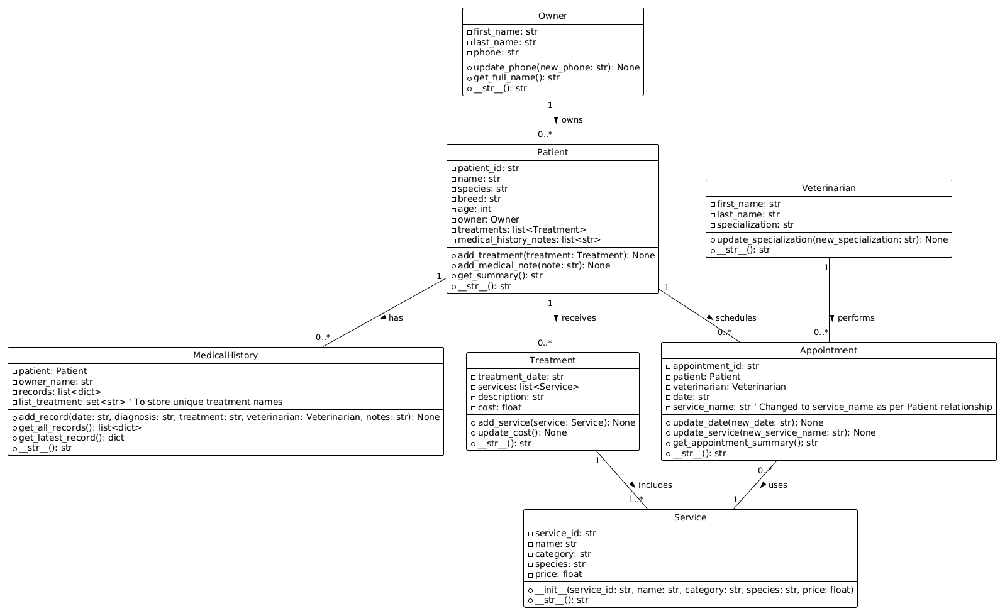

# **System Zarządzania Kliniką Weterynaryjną**

Ten projekt to kompleksowy system do zarządzania danymi pacjentów, właścicieli, lekarzy, wizyt, historii medycznej oraz oferowanych usług w wirtualnej klinice weterynaryjnej. Ma na celu usprawnienie organizacji i obiegu informacji w placówkach weterynaryjnych, zapewniając efektywne prowadzenie dokumentacji medycznej i planowanie pracy.

---

## **Spis Treści**
* [Wymagania Projektu](#wymagania-projektu)
* [Opis Funkcjonalności](#opis-funkcjonalności)
* [Struktura Modelu Dziedzinowego](#struktura-modelu-dziedzinowego)
* [Instalacja](#instalacja)
* [Sposób Użycia](#sposób-użycia)
* [Uruchamianie Testów](#uruchamianie-testów)
* [Współpraca Zespołowa](#współpraca-zespołowa)
* [Zespół Projektowy](#zespół-projektowy)
* [Diagram UML](#diagram-uml)
* [Zrzuty Ekranu](#zrzuty-ekranu)

---

## **Wymagania Projektu**

Projekt został stworzony zgodnie z poniższymi wytycznymi, kładąc nacisk na dobrą praktykę programistyczną i współpracę zespołową:

* **Projektowanie Modelu Dziedzinowego:** Zaimplementowano 7 klas w Pythonie do modelowania kluczowych encji systemu weterynaryjnej, z poprawnie zdefiniowanymi typami atrybutów i zwracanych wartości funkcji.
* **Czytelność Kodu i Dokumentacja:** Kod jest czytelny, rozbity na kilka plików i folderów (`src/models`, `src/models/services`), a każda klasa/funkcja posiada dokumentację w formie **docstringów**.
* **Testy Jednostkowe i Integracyjne:** Stworzono **17 testów jednostkowych** (po 3-5 na każdą klasę) oraz **3 testy integracyjne** symulujące kluczowe, złożone funkcjonalności.
* **Współpraca Zespołowa:** Projekt rozwijany był z wykorzystaniem narzędzi GitHub, obejmujących **gałęzie (branches)**, **Pull Requesty** oraz **Code Review**.
* **Kompleksowy Plik README.md:** Niniejszy plik stanowi główną dokumentację projektu, zawierającą opis, instrukcje i informacje o zespole.

---

## **Opis Funkcjonalności**

System zarządzania kliniką weterynaryjną oferuje następujące kluczowe funkcjonalności:

* **Zarządzanie Właścicielami (`Owner`):**
    * Rejestracja nowych właścicieli zwierząt wraz z ich danymi kontaktowymi (imię, nazwisko, numer telefonu).
    * Możliwość aktualizacji numeru telefonu właściciela.
* **Rejestracja i Zarządzanie Pacjentami (`Patient`):**
    * Dodawanie, edycja i usuwanie danych pacjentów (imię, gatunek, rasa, wiek, unikalny identyfikator).
    * Powiązanie pacjenta z jego właścicielem.
    * Dodawanie leczeń (`Treatment`) do historii pacjenta.
    * Dodawanie ogólnych notatek do historii medycznej pacjenta.
* **Zarządzanie Lekarzami Weterynarii (`Veterinarian`):**
    * Rejestracja lekarzy weterynarii wraz z ich specjalizacją.
    * Możliwość aktualizacji specjalizacji lekarza.
* **Planowanie i Zarządzanie Wizytami (`Appointment`):**
    * Tworzenie wizyt z przypisanym pacjentem, lekarzem, datą i określoną usługą.
    * Możliwość zmiany daty wizyty oraz usługi przypisanej do wizyty.
    * Generowanie podsumowania wizyty.
* **Definiowanie Usług Kliniki (`Service`):**
    * Rejestracja usług oferowanych przez klinikę (np. szczepienia, badania) z unikalnym ID, kategorią, przeznaczeniem dla gatunku i ceną.
    * Walidacja ceny usługi (nie może być ujemna).
* **Rejestrowanie i Rozliczanie Leczenia (`Treatment`):**
    * Dokumentowanie wykonanych zabiegów i leczeń, które składają się z listy usług (`Service`).
    * Automatyczne sumowanie całkowitego kosztu leczenia na podstawie przypisanych usług.
    * Możliwość dodawania kolejnych usług do istniejącego leczenia.
* **Prowadzenie Kompleksowej Historii Medycznej (`MedicalHistory`):**
    * Tworzenie szczegółowych wpisów dotyczących diagnoz, przebiegu leczenia, leków i notatek dla każdego pacjenta.
    * Przechowywanie listy wszystkich wykonanych zabiegów/leczeń (`list_treatment`) w historii.
    * Pobieranie wszystkich lub najnowszego wpisu z historii.

---

## **Struktura Modelu Dziedzinowego**

Projekt opiera się na następujących klasach, zorganizowanych w folderze `src/models` i `src/models/services`, reprezentujących kluczowe encje systemu i ich wzajemne powiązania:

* **`Owner` (`vetclinic/src/models/owner.py`):** Reprezentuje właściciela zwierzęcia. Zawiera **`first_name`**, **`last_name`**, **`phone`**.
* **`Patient` (`vetclinic/src/models/patient.py`):** Reprezentuje zwierzę – pacjenta kliniki. Zawiera **`patient_id`**, **`name`**, **`species`**, **`breed`**, **`age`**, odniesienie do **`owner`**, a także listy **`treatments`** (obiektów `Treatment`) oraz **`medical_history`** (notatki tekstowe).
* **`Veterinarian` (`vetclinic/src/models/veterinarian.py`):** Reprezentuje lekarza weterynarii. Atrybuty to **`first_name`**, **`last_name`**, **`specialization`**.
* **`Appointment` (`vetclinic/src/models/appointment.py`):** Reprezentuje zaplanowaną wizytę. Łączy **`appointment_id`**, **`patient`**, **`veterinarian`**, **`date`** wizyty (jako string) oraz **`service`** (nazwa usługi, jako string).
* **`MedicalHistory` (`vetclinic/src/models/medicalhistory.py`):** Reprezentuje historię medyczną pacjenta. Zawiera odniesienie do **`patient`**, **`owner`** (imię i nazwisko właściciela), listę **`records`** (słowników z datą, diagnozą, leczeniem, weterynarzem i notatkami) oraz `set` **`list_treatment`** (unikalne nazwy zabiegów/leczeń).
* **`Service` (`vetclinic/src/models/services/service.py`):** Definiuje pojedynczą usługę oferowaną przez klinikę. Atrybuty to **`service_id`**, **`name`**, **`category`**, **`species`** (dla jakiego gatunku), **`price`**.
* **`Treatment` (`vetclinic/src/models/services/treatment.py`):** Opisuje wykonane leczenie/zabieg. Zawiera **`treatment_date`**, listę wykonanych **`services`** (obiektów `Service`), **`description`**, oraz obliczony **`cost`**.

---

## **Instalacja**

Aby uruchomić projekt lokalnie, należy wykonać następujące kroki:

1.  **Sklonowanie Repozytorium:**
    ```bash
    git clone [https://github.com/Julia6400/InzynieriaOprogramowania.git](https://github.com/Julia6400/InzynieriaOprogramowania.git)
    cd InzynieriaOprogramowania
    ```

2.  **Przejście do katalogu projektu `vetclinic`:**
    ```bash
    cd vetclinic
    ```

3.  **Utworzenie Wirtualnego Środowiska (Zalecane):**
    ```bash
    python -m venv venv
    ```

4.  **Aktywowanie Wirtualnego Środowiska:**
    * **Windows:**
        ```bash
        .\venv\Scripts\activate
        ```
    * **macOS/Linux:**
        ```bash
        source venv/bin/activate
        ```

5.  **Zainstalowanie Wymaganych Bibliotek:**
    ```bash
    pip install -r requirements.txt
    ```

---

## **Sposób Użycia**

Po instalacji można uruchomić główny skrypt projektu `main.py`, który demonstruje podstawowe funkcjonalności systemu.

**Uruchamianie głównego programu (z katalogu `vetclinic`):**

```bash
python main.py
(Ponieważ main.py znajduje się bezpośrednio w katalogu vetclinic.)

Przykładowy wynik z działania main.py:

===== PODSUMOWANIE PACJENTA =====
Figo (pies, Beagle), 5 lat – Właściciel: Anna Kowalska - tel: 123-456-789

===== WIZYTA =====
Wizyta 1001: 2025-06-25 – Kontrola po zabiegu u Jan Nowak (Pacjent: Figo)

===== LECZENIE =====
Leczenie z dnia 2025-06-25: Wizyta po zabiegu | Usługi: Szczepienie, Badanie kontrolne | Koszt całkowity: 210.00 zł

===== HISTORIA MEDYCZNA =====
Historia medyczna: Figo (pies) – 1 wpisów, właściciel: Anna Kowalska
Ostatni wpis:
{'date': '2025-06-25', 'diagnosis': 'Brak komplikacji', 'treatment': 'Szczepienie + Badanie kontrolne', 'veterinarian': 'Jan Nowak', 'notes': 'Pacjent w dobrym stanie, zalecono obserwację.'}
```
---
**Uruchamianie Testów**
---
Projekt zawiera kompleksowy zestaw testów jednostkowych i integracyjnych, które można uruchomić za pomocą modułu unittest w Pythonie.

Należy upewnić się, że posiada się aktywne wirtualne środowisko.
Następnie przejść do katalogu projektu vetclinic.
Uruchomić testy, wskazując katalog tests (z katalogu vetclinic):
Bash
```bash
python -m unittest discover tests
```
(Moduł unittest automatycznie odnajdzie testy w podkatalogach unit_test i integrations_test.)

**Testy jednostkowe (17 przypadków):**

Znajdują się w vetclinic/tests/unit_test/:
* test_appointment.py (5 testów): Sprawdzają inicjalizację, reprezentację stringową, zmianę daty i usługi wizyty oraz podsumowanie.
* test_medicalhistory.py (6 testów): Weryfikują inicjalizację, dodawanie wpisów, pobieranie wszystkich i najnowszego wpisu oraz reprezentację stringową historii medycznej.
* test_owner.py (4 testy): Pokrywają tworzenie obiektu właściciela, jego reprezentację stringową, pobieranie pełnego imienia oraz aktualizację numeru telefonu.
* test_patient.py (5 testów): Testują inicjalizację, reprezentację stringową pacjenta, dodawanie leczeń i notatek do historii medycznej oraz generowanie podsumowania pacjenta.
* test_service.py (3 testy): Sprawdzają tworzenie usług, ich reprezentację stringową oraz walidację ujemnej ceny.
* test_treatment.py (3 testy): Weryfikują inicjalizację leczenia, dodawanie usług i aktualizację kosztów, oraz reprezentację stringową leczenia.

**Testy integracyjne (3 przypadki):**

Znajdują się w vetclinic/tests/integrations_test/:
* test_1.py (test_appointment_flow): Symuluje cały przepływ tworzenia wizyty, weryfikując poprawne powiązania między właścicielem, pacjentem, weterynarzem i wizytą.
* test_2.py (test_treatment_services_flow): Demonstruje dodawanie wielu usług do leczenia i weryfikuje poprawne sumowanie kosztów oraz powiązanie z pacjentem.
* test_3.py (test_medical_history_flow): Sprawdza dodawanie kompleksowego rekordu do historii medycznej pacjenta i pobieranie najnowszego wpisu.


## **Współpraca zespołowa**
Współpraca Zespołowa
Projekt został stworzony w oparciu o zasady współpracy zespołowej z wykorzystaniem platformy GitHub. Nasz proces pracy obejmował:

* Gałęzie (Branches): Wykorzystywaliśmy gałęzie main (stabilna wersja produkcyjna) i develop (główna gałąź rozwojowa). Każdy członek zespołu tworzył swoją indywidualną gałąź funkcjonalną (np. feature_new_patient) dla realizowanych zadań.
* Pull Requesty (PRs): Wszystkie zmiany były wprowadzane do gałęzi develop poprzez Pull Requesty.
* Code Review: Przed scaleniem każdego Pull Requesta, kod był poddawany przeglądowi przez innego członka zespołu, co zapewniało jakość i spójność kodu.
* Merge: Po zakończeniu sprintu/funkcjonalności, gałąź develop była regularnie scalana z main, opcjonalnie z oznaczeniem tagiem wersji (np. v1.0).

## **Zespół projektowy**
Projekt został stworzony przez następujący zespół, z podziałem ról i odpowiedzialności za poszczególne części modelu dziedzinowego:

* Julia Grzegorowska: Odpowiedzialna za klasy Patient i Appointment, oraz związane z nimi testy jednostkowe.
* Aleksander Włodarczyk: Odpowiedzialny za klasy Owner i Veterinarian, oraz związane z nimi testy jednostkowe.
* Roksana Kowalska: Odpowiedzialna za klasę MedicalHistory oraz związane z nią testy jednostkowe, a także za przygotowanie README.md.
* Anna Karwaszewska: Odpowiedzialna za klasę Treatment oraz związane z nią testy jednostkowe, a także za przygotowanie README.md.
* Maria Kaczor: Odpowiedzialna za klasę Service oraz związane z nią testy jednostkowe.

## **Diagram UML**
Poniżej znajduje się diagram UML przedstawiający strukturę klas w projekcie:


## **Zrzuty ekranu**
Poniżej przedstawiono przykładowy widok działania programu w konsoli:
